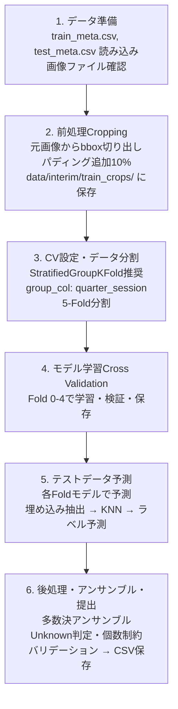
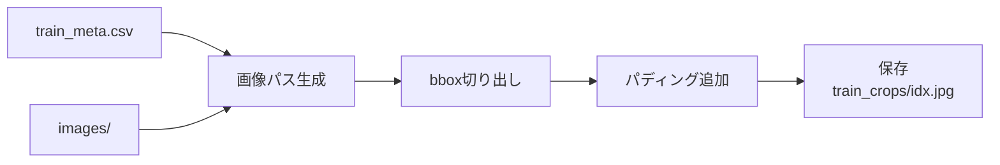
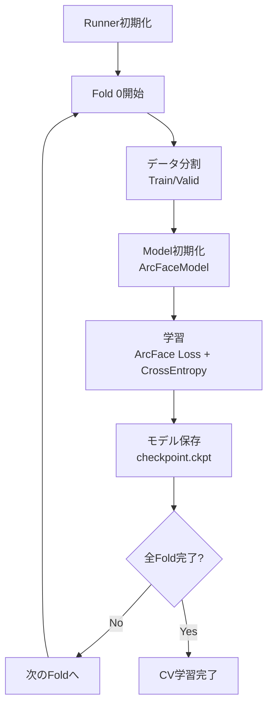
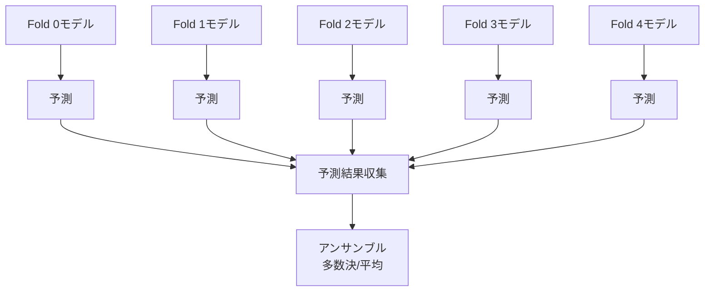
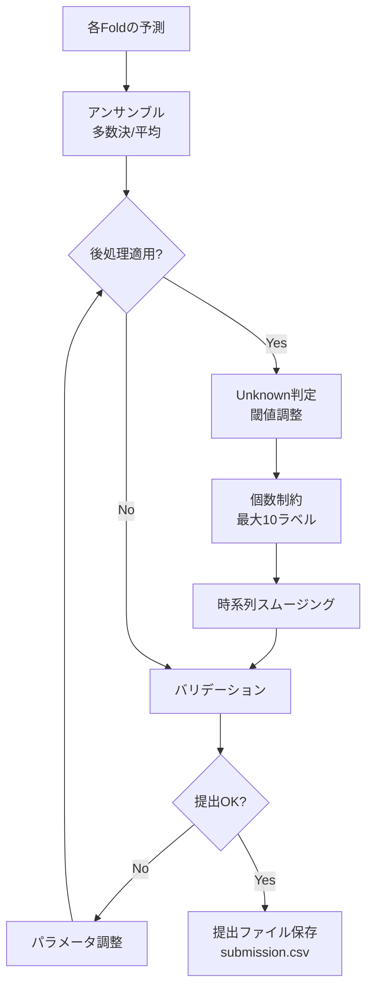
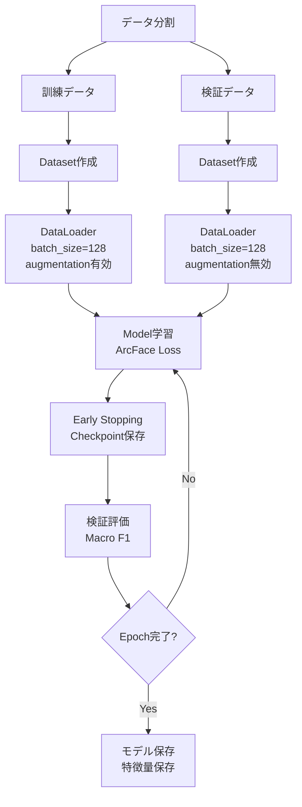
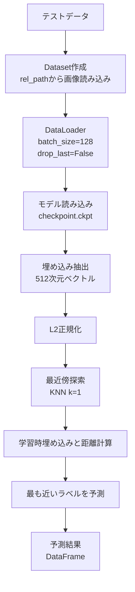

# 処理フロー図

## 全体フロー

```mermaid
graph TD
    A[1. データ準備<br/>train_meta.csv, test_meta.csv 読み込み<br/>画像ファイル確認] --> B[2. 前処理Cropping<br/>元画像からbbox切り出し<br/>パディング追加10%<br/>data/interim/train_crops/ に保存]
    B --> C[3. CV設定・データ分割<br/>StratifiedGroupKFold推奨<br/>group_col: quarter_session<br/>5-Fold分割]
    C --> D[4. モデル学習Cross Validation<br/>Fold 0-4で学習・検証・保存]
    D --> E[5. テストデータ予測<br/>各Foldモデルで予測<br/>埋め込み抽出 → KNN → ラベル予測]
    E --> F[6. 後処理・アンサンブル・提出<br/>多数決アンサンブル<br/>Unknown判定・個数制約<br/>バリデーション → CSV保存]
```

---

## 詳細フロー

### 前処理（Cropping）

```mermaid
graph LR
    A[train_meta.csv] --> C[画像パス生成]
    B[images/] --> C
    C --> D[bbox切り出し]
    D --> E[パディング追加]
    E --> F[保存<br/>train_crops/idx.jpg]
```

### CV学習

```mermaid
graph TD
    A[Runner初期化] --> B[Fold 0開始]
    B --> C[データ分割<br/>Train/Valid]
    C --> D[Model初期化<br/>ArcFaceModel]
    D --> E[学習<br/>ArcFace Loss + CrossEntropy]
    E --> F[モデル保存<br/>checkpoint.ckpt]
    F --> G{全Fold完了?}
    G -->|No| H[次のFoldへ]
    H --> B
    G -->|Yes| I[CV学習完了]
```

### テストデータ予測

```mermaid
graph TD
    A[Fold 0モデル] --> F[予測]
    B[Fold 1モデル] --> G[予測]
    C[Fold 2モデル] --> H[予測]
    D[Fold 3モデル] --> I[予測]
    E[Fold 4モデル] --> J[予測]
    
    F --> K[予測結果収集]
    G --> K
    H --> K
    I --> K
    J --> K
    
    K --> L[アンサンブル<br/>多数決/平均]
```

### 後処理・提出

```mermaid
graph TD
    A[各Foldの予測] --> B[アンサンブル<br/>多数決/平均]
    B --> C{後処理適用?}
    C -->|Yes| D[Unknown判定<br/>閾値調整]
    D --> E[個数制約<br/>最大10ラベル]
    E --> F[時系列スムージング]
    F --> G[バリデーション]
    C -->|No| G
    G --> H{提出OK?}
    H -->|No| I[パラメータ調整]
    I --> C
    H -->|Yes| J[提出ファイル保存<br/>submission.csv]
```

---

## Fold詳細フロー（各Fold共通）

```mermaid
graph TD
    A[データ分割] --> B[訓練データ]
    A --> C[検証データ]
    
    B --> D[Dataset作成]
    C --> E[Dataset作成]
    
    D --> F[DataLoader<br/>batch_size=128<br/>augmentation有効]
    E --> G[DataLoader<br/>batch_size=128<br/>augmentation無効]
    
    F --> H[Model学習<br/>ArcFace Loss]
    G --> H
    
    H --> I[Early Stopping<br/>Checkpoint保存]
    
    I --> J[検証評価<br/>Macro F1]
    
    J --> K{Epoch完了?}
    K -->|No| H
    K -->|Yes| L[モデル保存<br/>特徴量保存]
```

---

## 予測詳細フロー（テストデータ）

```mermaid
graph TD
    A[テストデータ] --> B[Dataset作成<br/>rel_pathから画像読み込み]
    B --> C[DataLoader<br/>batch_size=128<br/>drop_last=False]
    
    C --> D[モデル読み込み<br/>checkpoint.ckpt]
    
    D --> E[埋め込み抽出<br/>512次元ベクトル]
    
    E --> F[L2正規化]
    
    F --> G[最近傍探索<br/>KNN k=1]
    
    G --> H[学習時埋め込みと距離計算]
    
    H --> I[最も近いラベルを予測]
    
    I --> J[予測結果<br/>DataFrame]
```

---

最終更新: 2025-12-20
